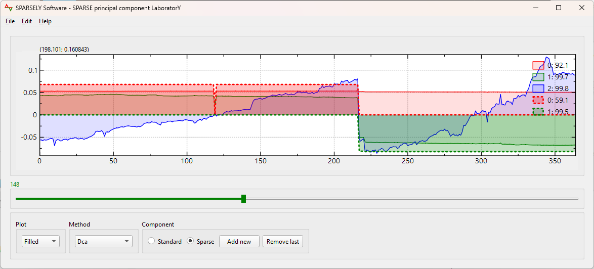

# Sparsepc
A header-only C++ library for sparse principal component computations.
A formulation of the Sparse Principal Component Problem is as follows
```math
(\text{SPCA}_{\Sigma}^{k})\;
\left\{
\begin{array}{ll}\max & x^{T}\Sigma x\\
	s.t.&x^{T}x = 1,\\
	&\left\|x\right\|_0 \leq k,\\
	&\;x\in\mathbb{R}^n,\\
\end{array} 
\right.
```
where the integer parameter $1 \leq k\leq n $ controls the sparsity of the solution.

## Sparsely
A standalone application that allows computing and selecting sparse principal components. It uses Sparsepc as solver.

[Visit web site](https://thiaothiao.github.io/sparsely/)


## Platforms
* Windows
* Ubuntu
* MacOs

## License
MPL 2.0

## Project status
Work In Progress